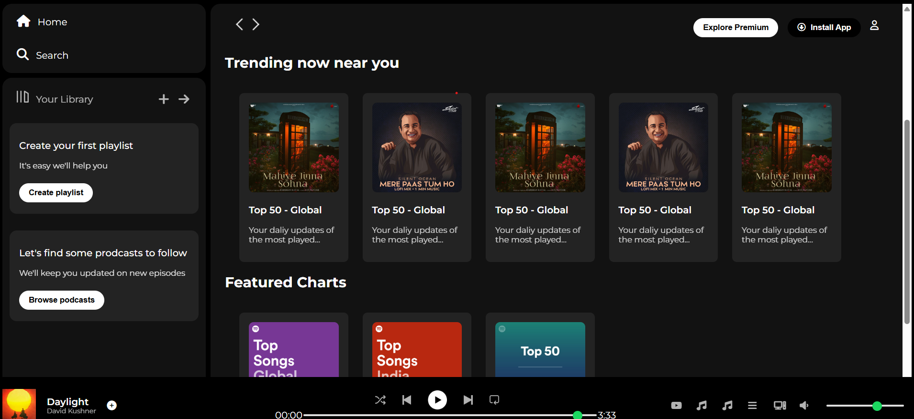

# 🎧 Spotify Clone

A sleek and responsive **Spotify-inspired music player UI** built using HTML, CSS, and JavaScript. This project mimics the look and feel of Spotify's web player — a perfect hands-on way to sharpen frontend skills.

---

## 🔥 Features

- 🎵 Beautiful music player layout inspired by Spotify
- 🖱️ Play/Pause buttons with dynamic UI updates
- 📜 Playlist UI with song list and cover art
- ⏱️ Basic progress bar functionality
- 💡 Fully responsive design

---

## 🛠️ Built With

- **HTML5**
- **CSS3**
---

## 🔗 Links  
- **Live Demo:** https://prashasthaa.github.io/Spotify_clone/
- **GitHub Repo:** https://github.com/Prashasthaa/Spotify_clone

## 🖼️ Preview

---

